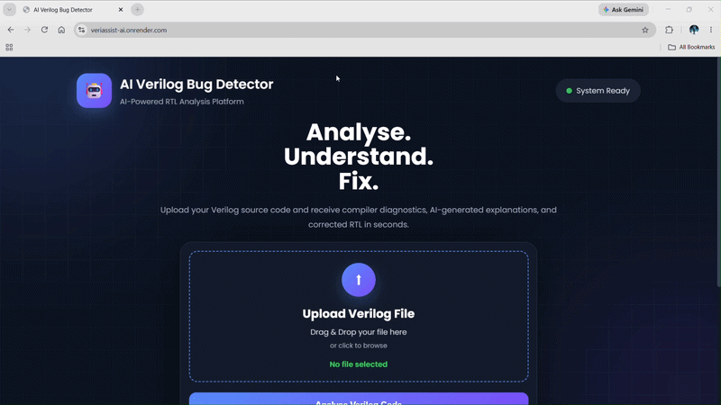
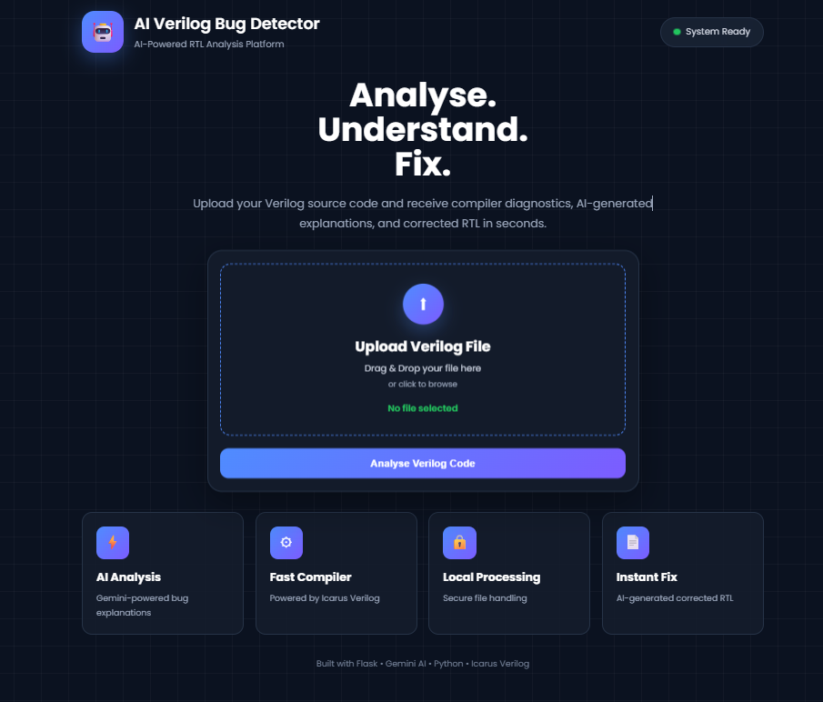
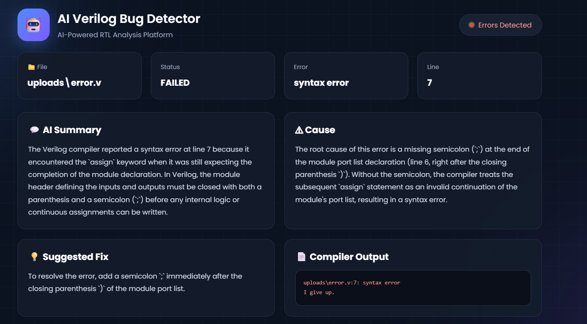
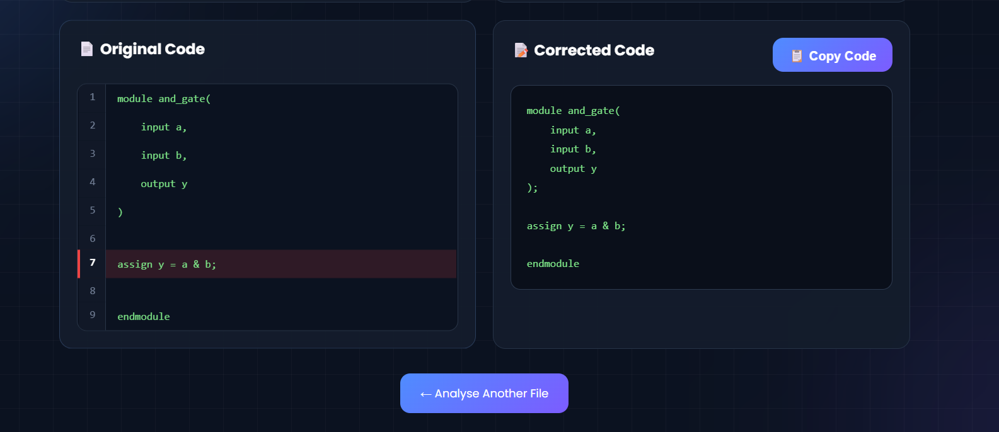

# 🤖 VeriAssist

### AI-Powered Verilog Learning & Debugging Assistant


---

## About

VeriAssist is a web-based Verilog debugging assistant built to help students understand compiler errors instead of simply displaying them.

Most Verilog compilers are excellent at detecting syntax errors, but they don't explain why the error occurred or how to fix it. While learning Verilog, I often found myself searching documentation or forums to understand compiler messages. This project was built to make that process easier.

VeriAssist combines **Icarus Verilog** with **Google Gemini AI** to analyze compiler errors, explain their cause, suggest fixes, and generate corrected Verilog code through a simple web interface.

The project is intended for students, beginners, and anyone learning digital design.

---

## Features

- Upload Verilog (`.v`) source files
- Compile designs using **Icarus Verilog**
- Parse compiler errors automatically
- AI-generated explanation of compiler errors
- Suggested fixes for detected errors
- AI-generated corrected Verilog code
- Highlight compiler error lines
- Side-by-side original and corrected code
- Copy corrected code with one click
- Responsive web interface
- Graceful fallback when the AI service is unavailable

---

## Live Demo

**Render Deployment**

<p align="center">
  
</p>

## Screenshots

### Landing Page



---

### AI Analysis



---

### Original vs Corrected Code



---
## 🔗 Links

- 🌐 **Live Demo:** https://veriassist-ai.onrender.com
- 📂 **GitHub Repository:** https://github.com/Chetan-Nandam/VeriAssist-AI

---

## How VeriAssist Works

```
User uploads Verilog file
          │
          ▼
Flask receives the file
          │
          ▼
Icarus Verilog compiles source code
          │
          ▼
Compiler errors are parsed
          │
          ▼
Gemini AI generates:
 • Summary
 • Cause
 • Suggested Fix
 • Corrected Code
          │
          ▼
Results displayed on dashboard
```

---

## System Architecture

```
                  User

                    │

                    ▼

          Upload Verilog File

                    │

                    ▼

             Flask Backend

          ┌───────────────┐
          │               │
          ▼               ▼

   Icarus Verilog     Gemini AI

          │               │

          └──────┬────────┘
                 ▼

        AI Error Analysis

                 │

                 ▼

      Interactive Results Dashboard
```

---

## Tech Stack

### Backend

- Python
- Flask

### Frontend

- HTML
- CSS
- JavaScript

### Compiler

- Icarus Verilog

### AI

- Google Gemini API

### Deployment

- Docker
- Render

### Version Control

- Git
- GitHub

---

## Project Structure

```
VeriAssist
│
├── ai/
│   ├── explain.py
│   ├── knowledge.py
│   ├── llm.py
│   └── prompts.py
│
├── compiler/
│   ├── compile.py
│   └── parser.py
│
├── static/
│   ├── css/
│   ├── js/
│   └── screenshots/
│
├── templates/
│   ├── index.html
│   └── result.html
│
├── uploads/
├── app.py
├── Dockerfile
├── requirements.txt
└── README.md
```

---

## Installation

Clone the repository

```bash
git clone https://github.com/Chetan-Nandam/VeriAssist-AI.git

cd VeriAssist-AI
```

Install dependencies

```bash
pip install -r requirements.txt
```

Create a `.env` file

```env
GEMINI_API_KEY=YOUR_API_KEY
```

Run the application

```bash
python app.py
```

Open

```
http://127.0.0.1:5000
```

---

## Docker

Build the Docker image

```bash
docker build -t veriassist .
```

Run the container

```bash
docker run -p 5000:5000 veriassist
```

---

## Challenges

Some challenges during development included:

- Parsing compiler errors into structured information
- Integrating AI responses into a consistent format
- Handling API failures gracefully
- Deploying Icarus Verilog with Docker on Render
- Keeping the frontend responsive while AI analysis was running

---

## What I Learned

Building VeriAssist gave me practical experience with:

- Flask application development
- REST-style request handling
- Compiler integration
- Docker deployment
- Google Gemini API
- Prompt engineering
- Error parsing
- Git and GitHub workflows

---

## Future Improvements

- Support for SystemVerilog
- Multi-file project support
- RTL simulation
- Waveform generation
- Download corrected Verilog code
- AI chat assistant for Verilog
- User accounts and history

---

## Author

**Chetan Nandam**

Electronics and Communication Engineering

Interested in

- Semiconductor Technology
- Digital Design
- FPGA Development
- VLSI
- AI-assisted Engineering Tools

GitHub

https://github.com/Chetan-Nandam

---

## License

This project is licensed under the MIT License.

---

## Support

If you found this project useful, consider giving it a ⭐ on GitHub.